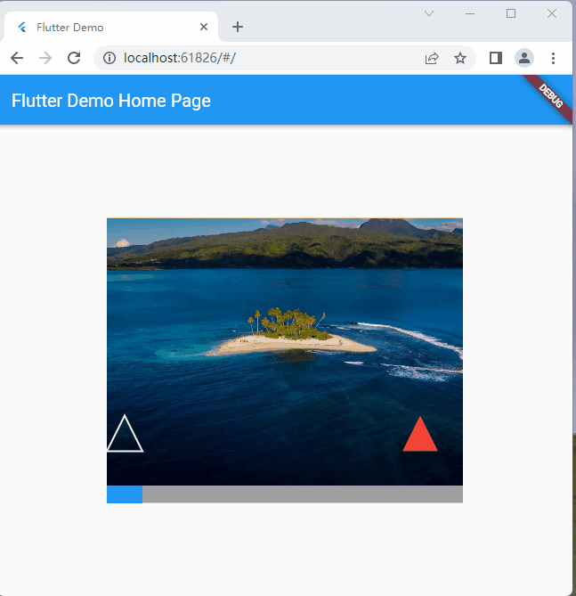

# flutter-verify
### slide verify



> code sample
>
> ```dart
>    SlideVerify(
>        imageUrl: "assets/1.jpg",
>        ifMatches: () async {
>        ScaffoldMessenger.of(context).showSnackBar(const SnackBar(
>            content: Text("matches"),
>            duration: Duration(seconds: 1),
>        ));
>        },
>    )
> ```
